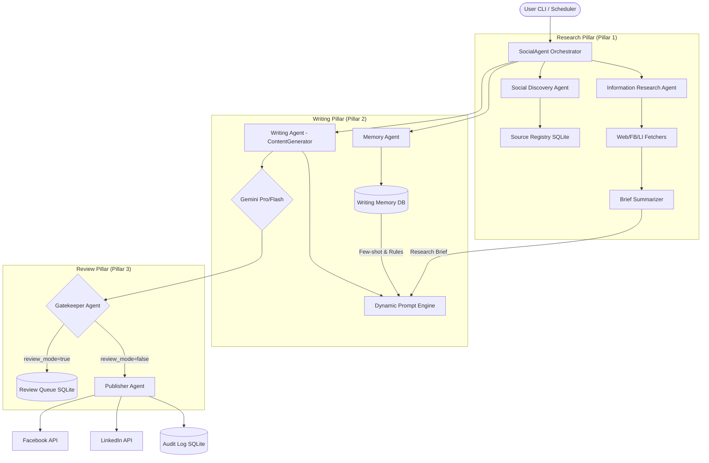

# Kiến trúc hệ thống Social Agent 🤖

## 🏗️ Tổng quan Multi-Agent Workflow

Hệ thống được thiết kế theo mô hình điều phối phân tán (Orchestrated Multi-Agent), nơi `SocialAgent` đóng vai trò nhạc trưởng điều phối các Agent chuyên biệt:



---

## 📂 Cấu trúc Dữ liệu & Folder (Modular Design)

Hệ thống chuyển từ cấu hình tập trung (`config.yaml` cũ) sang cấu trúc module hóa:

```
social-agent/
├── profiles/              # Branding, Tokens, Schedule riêng cho từng Profile/Page
├── topics/                # Định nghĩa Keyword, Description cho từng chủ đề
├── formats/               # Cấu trúc bài viết (Thought Leadership, Story, Insight)
├── cross_post_groups/     # Nhóm các targets để đăng đồng thời
├── data/
│   └── social_agent.db    # SQLite Core (Memory, Queue, Registry, Audit)
└── src/social_agent/      # Source code core
```

---

## 🧠 Cơ chế Học Liên Tục (Continuous Learning Loop)

Đây là linh hồn của hệ thống, giúp AI vượt qua sự rập khuôn của Prompts thông thường:

### 1. Học từ thành công (Approved Samples)
Khi một bài viết được **Approve**, `SocialAgent` sẽ lưu nội dung đó vào bảng `writing_memory`. Trong lần generate tiếp theo, các bài mẫu này được dùng làm **Few-shot examples** để AI bắt chước phong cách, emoji và cách ngắt dòng của những bài "chủ nhân thích".

### 2. Học từ thất bại (Learned Rules)
Khi một bài viết bị **Reject** kèm lý do, `ContentGenerator` sẽ gửi lý do đó cho Gemini để đúc kết thành một **Rule** (quy tắc) ngắn gọn (vd: "Không dùng hashtag ở đầu câu", "Tránh giọng văn quá học thuật"). Các quy tắc này được cộng dồn và áp dụng vĩnh viễn cho Profile đó cho đến khi được thay đổi.

---

## 🔍 Internet & Social Discovery

Hệ thống không còn phụ thuộc vào việc "dán tay" URL nguồn:
1.  **Discovery Phase**: Agent dùng Gemini Search Grounding tìm các bài báo/blog mới nhất theo Keywords của Topic.
2.  **Social Phase**: Agent dùng FB Graph API tìm các Fanpage có lượng tương tác cao liên quan đến chủ đề.
3.  **Registry**: Tất cả nguồn tìm được lưu vào `SourceRegistry` kèm điểm chất lượng. Nguồn nào fetch lỗi nhiều lần sẽ bị auto-disabled.

---

## 🛠️ Luồng Logic chính (FastDX Core)

1.  **Identify Target**: Xác định profile đang đăng (vd: `fastdx_page`).
2.  **Fetch Context**: 
    *   Load Branding (Tagline, Website, Hashtags).
    *   Load Writing Memory (3 Samples + Rules).
    *   Load Research Brief (Insights từ các nguồn mới nhất).
3.  **Synthesize Prompt**: Kết hợp tất cả Context vào một Prompt khổng lồ được tối ưu hóa cho Vietnamese SME context.
4.  **Content Audit**: Kiểm tra cấm kỵ (Banned phrases) và độ dài tối thiểu của Body (>= 120 từ).
5.  **Dedup**: Hash nội dung (SHA-256) và so sánh với lịch sử đăng để tránh post trùng lặp 100%.

---

## 📋 Schema Database (SQLite)

-   `registry`: URL, PageID, Score, LastFetch.
-   `writing_memory`: ProfileID, TopicID, Content (Sample), RejectionReason (Learned Rule).
-   `review_queue`: ID, Content, TargetID, BriefSummary, Status.
-   `audit_log`: ID, Target, Success, PostURL, ContentPreview, ContentHash.
